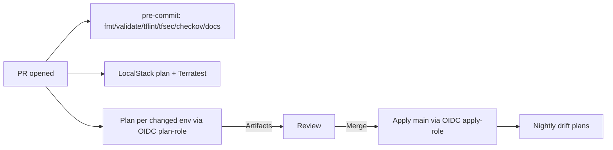

[](./.github/workflows/ci-pr.yml)
[](./.github/workflows/nightly-drift.yml)
[](./.github/workflows/release-please.yml)


# Opinionated Terraform

This is an opinionated terraform repo style that I look at for reference when writing Terraform at scale. 

Production-ready Terraform stacks for AWS: remote state in S3+DynamoDB, reusable modules (VPC/ECR/RDS/EKS), OIDC to AWS (no static keys), CI plans, nightly drift and LocalStack mode.

## Quickstart

### 0) Prereqs
- Terraform ≥ 1.9
- AWS CLI configured with admin to run bootstrap
- Docker for LocalStack (optional)

### 1) Bootstrap remote backends (per env)

```bash

cd tools/bootstrap-backend
terraform init
# Example for dev (eu-west-2)
terraform apply -auto-approve -var="org=coderco" -var="env=dev" -var="region=eu-west-2"
# Creates S3: tfstate-coderco-dev-eu-west-2 and DDB: tfstate-lock-coderco-dev
```

### 2) Configure OIDC roles in AWS

Create two IAM roles with GitHub OIDC trust and policies. 

Set your repo/environment vars:

- Repo Actions → Variables: AWS_ACCOUNT_ID (used by CI).
- Repo Secrets: INFRACOST_API_KEY.

### 3) Use the stacks

```bash
# dev
cd stacks/dev && terraform init && terraform plan
# staging/prod similar
```

4) LocalStack

```bash
cd localstack
docker compose up -d
cd ../stacks/local
terraform init && terraform plan
```

### 5) CI flow (Mermaid)



### Localstack caveats

| Service | Used       | Notes                                           |
| ------- | ---------- | ----------------------------------------------- |
| S3/DDB  | ✅          | State backend for `local` is local (no remote). |
| ECR     | ✅          | Repo metadata only.                             |
| EC2     | ✅          | For VPC/subnets/IGW/NAT stubs.                  |
| RDS/EKS | ❌ in local | Not created in `stacks/local` by design.        |

### Troubleshooting

- OIDC failed to assume role: verify trust JSON sub matches repo and branch (pull_request or ref:refs/heads/main).

- tflint ruleset missing: run tflint --init once locally.

- terraform-docs changed READMEs in CI: run pre-commit run terraform_docs -a and commit.

- Backend access denied: ensure apply/plan roles include S3/DDB perms above.

### Extending

- New env: copy stacks/dev → stacks/<env>, adjust backend bucket/table names and variables.

- New module: create under modules/<name>, add examples/, run terraform-docs, wire CI in reusable workflow.

- More OPA: add rules under tools/policies/ and make conftest.

